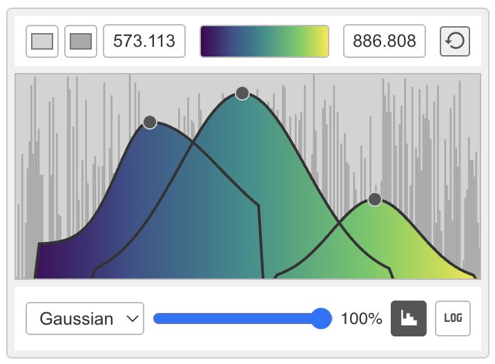

# AdvancedTransferFunctionEditor.vue - A Vue 3 Component

The `AdvancedTransferFunctionEditor.vue` is a sophisticated Vue 3 component designed for interactive creation and manipulation of 1D transfer functions and colormaps. It provides a rich user interface for defining how data values map to colors and opacities, commonly used in scientific visualization and data analysis applications.

## Project Goals

The primary goal of this component is to offer a flexible and intuitive way to:
*   Define and visualize colormaps.
*   Create complex transfer functions using linear segments or Gaussian distributions.
*   Adjust the overall opacity of the transfer function.
*   Visualize an underlying data distribution via an optional histogram.
*   Provide a themable and responsive user interface.

## Component Overview and Controls

The `AdvancedTransferFunctionEditor` provides a comprehensive set of controls to manage and define transfer functions. The main interface is organized as follows:



The component's UI is primarily divided into a top control area (organized into two rows) and a main editor area below it.

### Top Control Area

The top control area houses key controls for configuring the transfer function and editor behavior:

**First Row (Primary Settings):**
*   **Background Color Picker:** Allows selection of a base background color for the main editor canvas, helping to visualize how the transfer function will appear against different backgrounds.
*   **Histogram Color Picker:** Sets the color for the optional data histogram display.
*   **Min/Max Value Inputs:** Text input fields to define the data range (`minValue`, `maxValue`) over which the transfer function is applied.
*   **Colormap Selector (Dropdown):** A dropdown menu to select the active colormap from a predefined list. The selected colormap is displayed as a gradient.
*   **Reset Min/Max Values (Button with Restore Icon):** A button to reset the `minValue` and `maxValue` to their initial default settings.

**Second Row (Editor Mode and Display Options):**
*   **Transfer Function Mode Selector (Dropdown):** Allows switching the editor between 'Linear' mode (for piecewise linear functions) and 'Gaussian' mode (for functions defined by summing Gaussian curves).
*   **Global Opacity Slider:** Controls the overall opacity of the generated transfer function polygon. The current opacity percentage is displayed next to the slider.
*   **Histogram Toggle (Button with Chart Icon):** A button to show or hide the underlying data histogram in the editor area.
*   **Histogram Log Scale Toggle (Button with Math Log Icon):** A button to switch the histogram's y-axis between linear and logarithmic scales.

### Main Editor Area

Below the control area is the large interactive canvas where the transfer function is visually defined and manipulated. The appearance and interaction within this area change based on whether 'Linear' or 'Gaussian' mode is selected. This area is detailed further in the "Core Editors & Interactivity" section.

## Core Editors & Interactivity

The component features two main interactive editor modes for defining the transfer function:

### 1. Linear Transfer Function Editor

The linear editor allows users to define a piecewise linear transfer function by adding, moving, and deleting control points directly on a canvas. Each point defines a data value and its corresponding opacity.


*   **Add Points:** Click on an empty area in the editor canvas.
*   **Select Point:** Click on a control point.
*   **Move Points:** Click and hold on a selected point, then drag it horizontally (to change data value) or vertically (to change opacity).
*   **Delete Points:** Double-click on a point.
*   The background displays the selected colormap blended with the opacity defined by the linear function.

### 2. Gaussian Transfer Function Editor

The Gaussian editor enables the creation of transfer functions by summing multiple Gaussian components. Each Gaussian is defined by its center (mean), height (amplitude), width (standard deviation), and bias.


*   **Add Gaussians:** Click on an empty area in the editor canvas to add a new Gaussian centered at the click location.
*   **Select Gaussian or its Handles:** Click on a Gaussian's body to select the entire component, or click on one of its handles (peak, width, bias) to begin manipulating it.
*   **Move Gaussian:** Click and hold on the peak control point (circle) of a selected Gaussian, then drag horizontally to change its center (data value) and vertically to change its maximum opacity (height).
*   **Adjust Width:** Click and hold on the horizontal square handles at the base of a selected Gaussian, then drag to change its width.
*   **Adjust Bias:** Click and hold on the vertical triangle handles of a selected Gaussian, then drag to adjust its bias, affecting the curve's skewness.
*   **Delete Gaussian:** Double-click on a Gaussian's peak control point.

## Features

## Managing Colormaps

The `AdvancedTransferFunctionEditor` component loads its available colormaps from an external JSON file located at `src/assets/colormaps.json`. You can customize the available colormaps by editing this file.

### Colormap JSON Structure

The `colormaps.json` file should contain a JSON array of colormap objects. Each object in the array defines a single colormap and must have the following structure:

```json
{
  "name": "Your Colormap Name",
  "points": [
    { "x": 0.0, "r": 0.267, "g": 0.005, "b": 0.329 },
    { "x": 0.5, "r": 0.129, "g": 0.565, "b": 0.553 },
    { "x": 1.0, "r": 0.993, "g": 0.906, "b": 0.144 }
  ]
}
```

*   **`name`**: (String) This is the human-readable name that will appear in the colormap selection dropdown in the component's UI.
*   **`points`**: (Array of Objects) An array of color points that define the colormap.
    *   Each point object in the array must have the following properties:
        *   **`x`**: (Number) The normalized position of the color point along the gradient, ranging from `0.0` (start) to `1.0` (end). Points should ideally be sorted by their `x` value, though the component will attempt to sort them.
        *   **`r`**: (Number) The red component of the color, normalized between `0.0` (no red) and `1.0` (full red).
        *   **`g`**: (Number) The green component of the color, normalized between `0.0` (no green) and `1.0` (full green).
        *   **`b`**: (Number) The blue component of the color, normalized between `0.0` (no blue) and `1.0` (full blue).
    *   You need at least two points to define a gradient. A single point will result in a solid color.

### Updating Available Colormaps

To add, remove, or modify the colormaps available in the component:

1.  **Locate the file**: Open `src/assets/colormaps.json` in your project.
2.  **Add a new colormap**:
    *   Append a new JSON object to the array, following the structure described above.
    *   Ensure your `name` is unique and descriptive.
    *   Define the `points` array with at least two color points, ensuring `x`, `r`, `g`, `b` values are normalized between 0.0 and 1.0.
3.  **Modify an existing colormap**:
    *   Edit the `name` or modify the `points` array (add, remove, or change points) of an existing colormap object.
4.  **Remove a colormap**:
    *   Delete the corresponding JSON object from the array.
5.  **Save the file**: After making your changes, save `colormaps.json`.

The component will automatically pick up these changes the next time it loads.

**Example `colormaps.json`:**

```json
[
  {
    "name": "Custom RGB",
    "points": [
      { "x": 0.0, "r": 1.0, "g": 0.0, "b": 0.0 },
      { "x": 0.5, "r": 0.0, "g": 1.0, "b": 0.0 },
      { "x": 1.0, "r": 0.0, "g": 0.0, "b": 1.0 }
    ]
  },
  {
    "name": "Viridis",
    "points": [
      { "x": 0.0,  "r": 0.2666, "g": 0.0039, "b": 0.3294 },
      { "x": 0.25, "r": 0.2313, "g": 0.3215, "b": 0.5450 },
      { "x": 0.5,  "r": 0.1294, "g": 0.5647, "b": 0.5529 },
      { "x": 0.75, "r": 0.3647, "g": 0.7843, "b": 0.3882 },
      { "x": 1.0,  "r": 0.9921, "g": 0.9058, "b": 0.1450 }
    ]
  },
  {
    "name": "Grayscale",
    "points": [
      { "x": 0.0, "r": 0.0, "g": 0.0, "b": 0.0 },
      { "x": 1.0, "r": 1.0, "g": 1.0, "b": 1.0 }
    ]
  }
]
```


*   **Colormap Selection:**
    *   Choose from a predefined list of colormaps.
    *   Colormaps are loaded from an external `colormaps.json` file.
    *   The selected colormap is displayed as a gradient in the UI and applied to the transfer function editor.
*   **Min/Max Value Range:**
    *   Define the data range (`minValue`, `maxValue`) over which the transfer function is applied.
    *   Inputs for `minValue` and `maxValue` with validation (min < max).
    *   Reset button to revert to initial default min/max values.
*   **Transfer Function Modes:**
    *   Switch between 'Linear' and 'Gaussian' editor modes.
*   **Transfer Function Opacity:**
    *   Global opacity slider to control the overall opacity of the generated transfer function.
    *   Percentage display for current opacity.
*   **Histogram Display:**
    *   Toggle the visibility of an underlying data histogram.
    *   Select the color of the histogram.
    *   (Note: The component expects histogram data to be provided as a prop if this feature is to be fully utilized).
*   **Theming:**
    *   Supports light and dark themes, switchable via a toggle.
    *   Uses CSS custom properties for easy customization.
*   **Interactive Controls:**
    *   Color swatch for selecting a base background color for the editor area.
    *   Tooltips for all interactive UI elements for better usability.
*   **Responsive Design:**
    *   UI elements adjust to fit within the component's width.

## Configuration (Props)

The component can be configured through Vue props. While many settings have internal defaults, you can override them by passing these props:

*   **`initial-min-value-prop`**:
    *   Type: `Number` or `String`
    *   Default: `573.113`
    *   Description: Sets the initial minimum value of the data range. This value is also used by the component's reset functionality.
*   **`initial-max-value-prop`**:
    *   Type: `Number` or `String`
    *   Default: `886.808`
    *   Description: Sets the initial maximum value of the data range. This value is also used by the component's reset functionality.
*   **`initial-transfer-function-mode-prop`**:
    *   Type: `String` ('linear' or 'gaussian')
    *   Default: `'linear'`
    *   Description: Sets the initial transfer function editor mode. Accepts 'linear' or 'gaussian'. This value is validated by the component.
*   **`initial-theme-prop`**:
    *   Type: `String` ('light' or 'dark')
    *   Default: `'light'`
    *   Description: Sets the initial theme for the component. Accepts 'light' or 'dark'. This value is validated by the component.
*   **`histogram-data-prop`**:
    *   Type: `Array`
    *   Default: `[]` (empty array)
    *   Description: An array of numbers representing the histogram data. If this prop is provided with a non-empty array, the component will use this data for the histogram display and will skip its internal sample histogram generation. Example: `[10, 20, 50, 30, 15]`

### Example Usage of Props

You can pass these props to the `<AdvancedTransferFunctionEditor>` component from its parent like so:

```html
<template>
  <AdvancedTransferFunctionEditor
    :initial-min-value-prop="500" 
    :initial-max-value-prop="1000"
    :histogram-data-prop="[10, 25, 70, 40, 15]"
    initial-theme-prop="dark"
    initial-transfer-function-mode-prop="gaussian"
  />
</template>

<script>
import AdvancedTransferFunctionEditor from './components/AdvancedTransferFunctionEditor.vue';

export default {
  components: {
    AdvancedTransferFunctionEditor
  },
  data() {
    return {
      // Example: if your histogram data is dynamic and bound
      // myHistogramData: [10, 25, 70, 40, 15] 
    };
  }
};
</script>
```
**Note:** For props of type `String` (like `initial-theme-prop` if not bound to dynamic data, e.g., `initial-theme-prop="dark"`), you can pass them without `v-bind`. For `Number`, `Array`, `Boolean` types, or when binding to a data property in your parent component, always use `v-bind` (or the shorthand `:`).

## Output API (Events & Data Access)

To get the resulting transfer function data from the component, you can:

1.  **Listen to Events:** The component should emit events when the transfer function changes.
    *   Example: `@update:transferFunction`
    *   Payload for Linear Mode: An array of points, e.g., `[{value: 573.113, opacity: 0.0}, {value: 700, opacity: 0.8}, {value: 886.808, opacity: 1.0}]`.
    *   Payload for Gaussian Mode: An array of Gaussian objects, e.g., `[{center: 600, height: 0.8, width: 50, bias: 0}, {center: 750, height: 0.5, width: 30, bias: 0.2}]`.

2.  **Access via `v-model` or Refs (if applicable):** Depending on the component's internal structure, you might use `v-model` on a prop that holds the combined transfer function or access computed properties via a template ref.

    *   **Recommended Output Structure (Combined Transfer Function):**
        A common requirement is a sampled version of the transfer function, often an array of `[value, opacity]` pairs or `[value, r, g, b, a]` across the `minValue` to `maxValue` range. The component should ideally provide this directly or through a method.

    *   **Example of a desired output for a sampled transfer function (e.g., 256 samples):**
      ```javascript
      // Array of [value, red, green, blue, alpha]
      // Alpha is derived from the editor, RGB from the colormap
      [
        [573.113, 0.267, 0.004, 0.329, 0.0], // Sample 1
        [574.345, 0.268, 0.005, 0.331, 0.01], // Sample 2
        // ...
        [886.808, 0.993, 0.906, 0.143, 1.0]  // Sample 256
      ]
      ```
      (The exact mechanism for retrieving this combined, sampled output needs to be clearly defined in the component's API, likely via an event or a get method.)

## Project Setup (Standard Vite/Vue)

This project was scaffolded with Vite.

```sh
npm install
```

### Compile and Hot-Reload for Development

```sh
npm run dev
```

### Compile and Minify for Production

```sh
npm run build
```
---

This README provides a comprehensive overview. For detailed implementation of props and events, refer to the `AdvancedTransferFunctionEditor.vue` source code.
