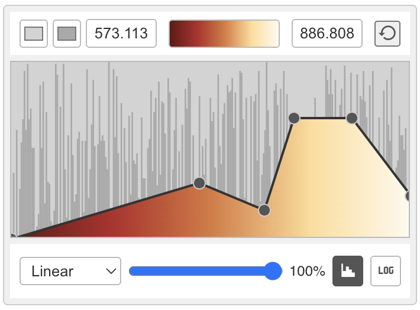

# AdvancedColorPicker.vue - A Vue 3 Component

The `AdvancedColorPicker.vue` is a sophisticated Vue 3 component designed for interactive creation and manipulation of 1D transfer functions and colormaps. It provides a rich user interface for defining how data values map to colors and opacities, commonly used in scientific visualization and data analysis applications.

## Project Goals

The primary goal of this component is to offer a flexible and intuitive way to:
*   Define and visualize colormaps.
*   Create complex transfer functions using linear segments or Gaussian distributions.
*   Adjust the overall opacity of the transfer function.
*   Visualize an underlying data distribution via an optional histogram.
*   Provide a themable and responsive user interface.

## Core Editors & Interactivity

The component features two main interactive editor modes for defining the transfer function:

### 1. Linear Transfer Function Editor

The linear editor allows users to define a piecewise linear transfer function by adding, moving, and deleting control points directly on a canvas. Each point defines a data value and its corresponding opacity.



*   **Add Points:** Click on an empty area in the editor canvas.
*   **Move Points:** Drag existing points horizontally (to change data value) or vertically (to change opacity).
*   **Delete Points:** Right-click (or context-click) on a point.
*   The background displays the selected colormap blended with the opacity defined by the linear function.

### 2. Gaussian Transfer Function Editor

The Gaussian editor enables the creation of transfer functions by summing multiple Gaussian components. Each Gaussian is defined by its center (mean), height (amplitude), width (standard deviation), and bias.


*   **Add Gaussians:** Click on an empty area in the editor canvas to add a new Gaussian centered at the click location.
*   **Select Gaussian:** Click on a Gaussian to select it for editing.
*   **Move Gaussian:** Drag the peak control point (circle) of a selected Gaussian to change its center and height.
*   **Adjust Width:** Drag the horizontal square handles at the base of a selected Gaussian to change its width.
*   **Adjust Bias:** Drag the vertical triangle handles of a selected Gaussian to adjust its bias, affecting the curve's skewness.
*   **Delete Gaussian:** Right-click (or context-click) on a Gaussian's peak control point.

## Features

*   **Colormap Selection:**
    *   Choose from a predefined list of colormaps.
    *   Colormaps are loaded from an external `colormaps.json` file.
    *   The selected colormap is displayed as a gradient in the UI and applied to the transfer function editor.
*   **Min/Max Value Range:**
    *   Define the data range (`minValue`, `maxValue`) over which the transfer function is applied.
    *   Inputs for `minValue` and `maxValue` with validation (min < max).
    *   Reset button to revert to initial default min/max values.
*   **Transfer Function Modes:**
    *   Switch between 'Linear' and 'Gaussian' editor modes.
*   **Transfer Function Opacity:**
    *   Global opacity slider to control the overall opacity of the generated transfer function.
    *   Percentage display for current opacity.
*   **Histogram Display:**
    *   Toggle the visibility of an underlying data histogram.
    *   Select the color of the histogram.
    *   (Note: The component expects histogram data to be provided as a prop if this feature is to be fully utilized).
*   **Theming:**
    *   Supports light and dark themes, switchable via a toggle.
    *   Uses CSS custom properties for easy customization.
*   **Interactive Controls:**
    *   Color swatch for selecting a base background color for the editor area.
    *   Tooltips for all interactive UI elements for better usability.
*   **Responsive Design:**
    *   UI elements adjust to fit within the component's width.

## Configuration (Props)

The component can be configured through Vue props. While many settings have internal defaults, you can override them by passing these props:

*   **`initialColormaps`**:
    *   Type: `Array`
    *   Description: An array of colormap objects. If not provided, it attempts to load from `src/assets/colormaps.json`.
    *   Structure of `colormaps.json` (and `initialColormaps` prop):
      ```json
      [
        {
          "name": "Viridis",
          "points": [
            {"value": 0.0, "color": [0.267004, 0.004874, 0.329415]}, // R, G, B values (0-1)
            {"value": 0.5, "color": [0.127568, 0.566949, 0.550556]},
            {"value": 1.0, "color": [0.993248, 0.906157, 0.143936]}
          ]
        },
        // ... more colormaps
      ]
      ```
*   **`initialMinValue`**:
    *   Type: `Number` or `String`
    *   Default: `573.113`
    *   Description: The initial minimum value of the data range.
*   **`initialMaxValue`**:
    *   Type: `Number` or `String`
    *   Default: `886.808`
    *   Description: The initial maximum value of the data range.
*   **`initialColorSwatchValue`**:
    *   Type: `String` (CSS color)
    *   Default: `'#D3D3D3'` (light grey)
    *   Description: Initial background color for the main picker area.
*   **`initialHistogramColor`**:
    *   Type: `String` (CSS color)
    *   Default: `'#A9A9A9'` (medium grey)
    *   Description: Initial color for the histogram display.
*   **`initialTransferFunctionOpacity`**:
    *   Type: `Number` (0.0 to 1.0)
    *   Default: `1.0`
    *   Description: Initial global opacity for the transfer function.
*   **`initialTransferFunctionMode`**:
    *   Type: `String` ('linear' or 'gaussian')
    *   Default: `'linear'`
    *   Description: The transfer function editor mode to start with.
*   **`initialShowHistogram`**:
    *   Type: `Boolean`
    *   Default: `true`
    *   Description: Whether the histogram is initially visible.
*   **`initialTheme`**:
    *   Type: `String` ('light' or 'dark')
    *   Default: `'light'`
    *   Description: The initial theme for the component.
*   **`histogramData`**:
    *   Type: `Array`
    *   Default: `[]` (empty array, resulting in no histogram drawn by default unless populated)
    *   Description: An array of numbers representing the histogram bins. The component will normalize and render this data if provided. Example: `[10, 20, 50, 30, 15]`

## Output API (Events & Data Access)

To get the resulting transfer function data from the component, you can:

1.  **Listen to Events:** The component should emit events when the transfer function changes.
    *   Example: `@update:transferFunction`
    *   Payload for Linear Mode: An array of points, e.g., `[{value: 573.113, opacity: 0.0}, {value: 700, opacity: 0.8}, {value: 886.808, opacity: 1.0}]`.
    *   Payload for Gaussian Mode: An array of Gaussian objects, e.g., `[{center: 600, height: 0.8, width: 50, bias: 0}, {center: 750, height: 0.5, width: 30, bias: 0.2}]`.

2.  **Access via `v-model` or Refs (if applicable):** Depending on the component's internal structure, you might use `v-model` on a prop that holds the combined transfer function or access computed properties via a template ref.

    *   **Recommended Output Structure (Combined Transfer Function):**
        A common requirement is a sampled version of the transfer function, often an array of `[value, opacity]` pairs or `[value, r, g, b, a]` across the `minValue` to `maxValue` range. The component should ideally provide this directly or through a method.

    *   **Example of a desired output for a sampled transfer function (e.g., 256 samples):**
      ```javascript
      // Array of [value, red, green, blue, alpha]
      // Alpha is derived from the editor, RGB from the colormap
      [
        [573.113, 0.267, 0.004, 0.329, 0.0], // Sample 1
        [574.345, 0.268, 0.005, 0.331, 0.01], // Sample 2
        // ...
        [886.808, 0.993, 0.906, 0.143, 1.0]  // Sample 256
      ]
      ```
      (The exact mechanism for retrieving this combined, sampled output needs to be clearly defined in the component's API, likely via an event or a get method.)

## Project Setup (Standard Vite/Vue)

This project was scaffolded with Vite.

```sh
npm install
```

### Compile and Hot-Reload for Development

```sh
npm run dev
```

### Compile and Minify for Production

```sh
npm run build
```
---

This README provides a comprehensive overview. For detailed implementation of props and events, refer to the `AdvancedColorPicker.vue` source code.
